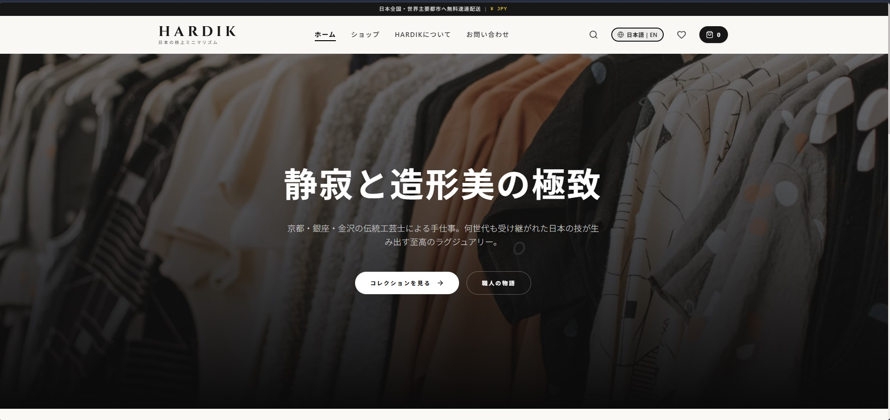
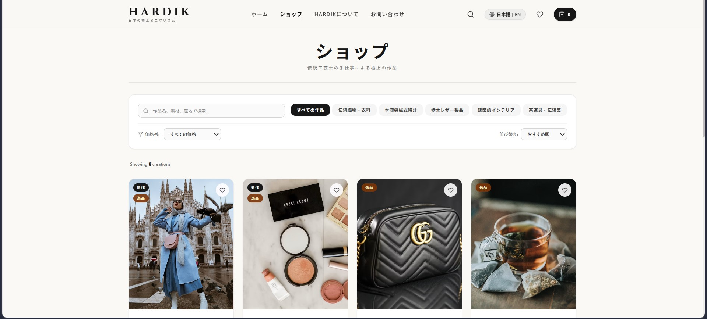
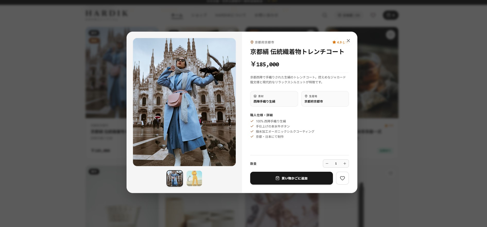

# ✦ HARDIK

<p align="center">
  
</p>

<p align="center">
  <strong>Premium E-Commerce Frontend Experience</strong>
</p>

<p align="center">
  A modern, responsive and elegant e-commerce frontend built with React, JavaScript, Tailwind CSS and Vite.
</p>

<p align="center">
  <a href="#-features">Features</a> •
  <a href="#-preview">Preview</a> •
  <a href="#-tech-stack">Tech Stack</a> •
  <a href="#-installation">Installation</a> •
  <a href="#-project-structure">Structure</a>
</p>

---

## ✦ Overview

**HARDIK** is a modern e-commerce frontend designed with a strong focus on **premium UI, responsive design, smooth interactions and reusable React components**.

The project was created to demonstrate how a real-world shopping experience can be designed and developed using modern frontend technologies.

The interface uses a clean and minimal visual language while keeping the experience intuitive across desktop, tablet and mobile devices.

> **Simple. Elegant. Responsive. Functional.**

---

## ✨ Features

### 🛍️ Shopping Experience

- Browse products
- Product categories
- Product details
- Search products
- Category filtering
- Price filtering
- Product sorting
- Add to cart
- Remove from cart
- Quantity management
- Wishlist
- Related products

### 🌐 Localization

- English interface
- Japanese interface
- Japanese Yen (¥) currency

### 💾 Client-Side Persistence

Cart and wishlist data are stored using browser **Local Storage**, allowing user selections to remain available after refreshing the page.

### 📱 Responsive Design

Designed and optimized for:

- Desktop
- Laptop
- Tablet
- Mobile

### ✨ UI / UX

- Premium light theme
- Minimal visual design
- Smooth transitions
- Hover interactions
- Soft shadows
- Rounded components
- Clean typography
- Consistent spacing
- Responsive layouts
- Modern product cards

---

# ✦ Preview

## 🏠 Home Page



---

## 🛍️ Shop Page



---

## 📦 Product Details



# ✦ Tech Stack

<p align="center">


</p>

### Core Technologies

| Technology | Purpose |
|---|---|
| **React** | Component-based UI development |
| **JavaScript** | Application logic and interactions |
| **Tailwind CSS** | Styling and responsive design |
| **HTML5** | Semantic page structure |
| **Vite** | Development and build tooling |
| **Local Storage** | Client-side data persistence |

---

# ✦ Why These Technologies?

### React

React is used to build the interface using **reusable and maintainable components**.

Examples include:

- Navbar
- Product Card
- Product Grid
- Search
- Filters
- Cart
- Footer

This makes the application easier to maintain and scale.

### JavaScript

JavaScript handles the application's interactive functionality, including:

- Searching
- Filtering
- Sorting
- Cart management
- Wishlist management
- Quantity updates
- User interactions

### Tailwind CSS

Tailwind CSS provides a utility-first approach to styling.

It was used to create:

- Responsive layouts
- Consistent spacing
- Buttons
- Cards
- Navigation
- Forms
- Responsive components

### Vite

Vite provides a fast development environment and efficient production build process.

### Local Storage

Local Storage is used to persist:

- Cart items
- Wishlist items

This allows the user to keep their selections even after refreshing the browser.

---

# ✦ Design Philosophy

The design of HARDIK follows a **premium minimal aesthetic**.

### Visual Principles

```text
Clean Layout
     ↓
Generous Whitespace
     ↓
Clear Typography
     ↓
Consistent Components
     ↓
Subtle Interactions
     ↓
Smooth User Experience
